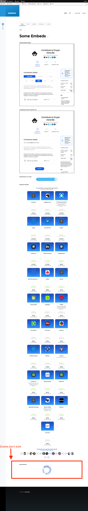

# Drupal Open Collective Stuff

This is just a practice/example repo. It is not supported at this time.

## Screenshots of Field Formatters

These screenshots show all field formatters on one node.

* [node edit page](docs/images/oc-node-edit.png)
  * Each field is a textfield, because we pretty much just need to know the collective IDs. This value could be provided
      the field formatter in other ways, via token or whatnot if desired (and implemented).
* [field configurations](docs/images/oc-field-formatters-configuration.png)
  * Contribution Flow options:
    * Tier: If left blank, the default "Donate" tier is shown. Otherwise, the given tier's contribution flow is embedded.
  * Button options:
    * Color: [blue|white]
    * Verb: [donate|contribute]
  * Banner options:
    * Banner Type: [supporters|events]

